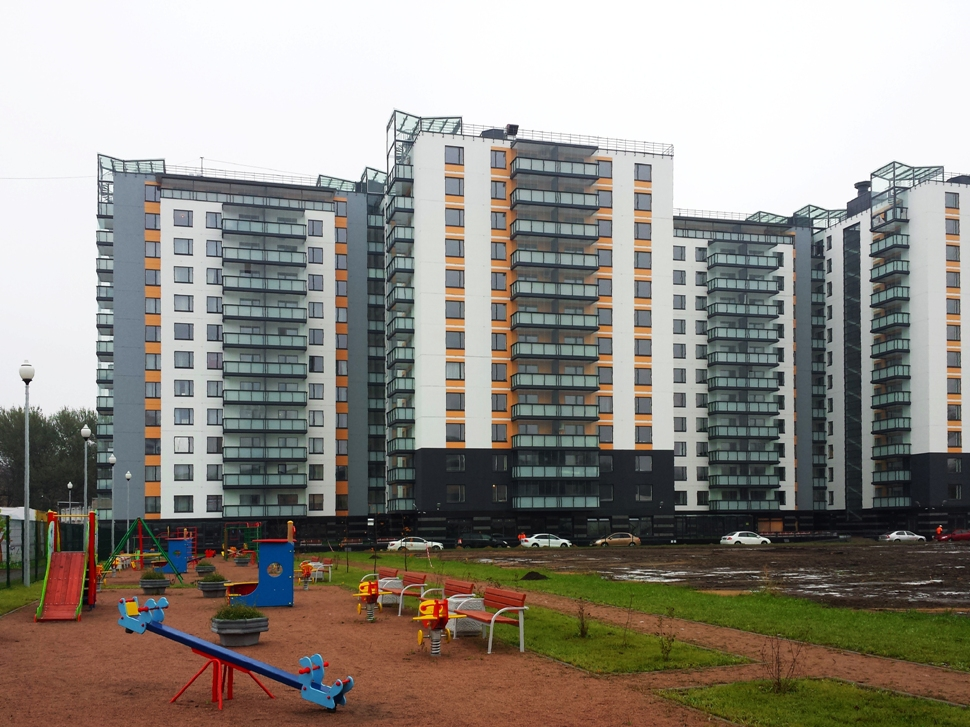

## ДЕТАЛИ

**Ген. подрядчик**: ООО «Лемминкяйнен Строй»  
**Партнер**: ООО «Лемминкяйнен Строй»  
**Местоположение**: г.Санкт-Петербург, пр. КИМа, д.1  
**Начало работ**: Декабрь 2012  
**Окончание работ**: Июнь 2014

## О ПРОЕКТЕ

Жилой комплекс «Айно» — новый проект от финской компании «Лемминкяйнен» в историческом центре Васильевского острова города Санкт-Петербурга. ЖК «Айно» состоит из 6 секций по 13 этажей. Жилой комплекс был возведен в кратчайшие сроки.

Наши специалисты производили геодезическое сопровождение данного объекта с декабря 2012г. по июнь 2014 года. На данном объекте производились не только геодезические работы по разбивке осей с созданием исполнительных схем по готовым конструкциям, но и работы по детальной разбивке элементов конструкций здания с созданием исп. схем перед бетонированием или перед фиксацией конструкций.
Также на данном объекте производились топографические работы и контрольно-исполнительные съемки (КИС).
