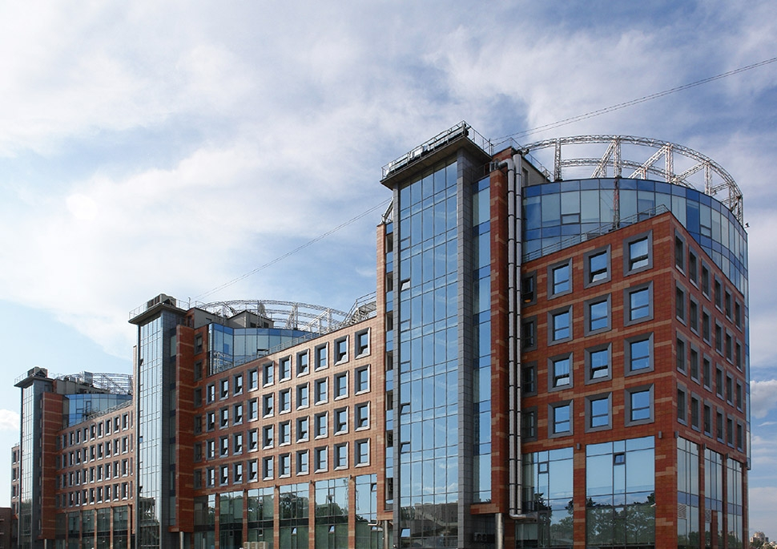

## ДЕТАЛИ

**Ген. подрядчик**: ООО «Ремстрой-7»  
**Партнер**: ООО «Электрон»  
**Местоположение**: г.Санкт-Петербург, Аптекарская наб. 17  
**Начало работ**: Март 2006  
**Окончание работ**: Январь 2008

## О ПРОЕКТЕ

Компания ООО «Электрон» являлась заказчиком и нашим партнером на этом проекте БЦ «Авеню».

Наши сотрудники производили геодезические работы с момента начала реконструкции здания (каркас здания на уровне 3 этажа) до завершения проекта, а также производили наблюдение за осадками здания, начиная с окончания работ по установке металлоконструкций до ввода в эксплуатацию здания. Также на данном объекте производились топографические работы и контрольно-исполнительные съемки (КИС).

Данный проект победил в Конкурсе FIABCI -Russia «Лучший реализованный девелоперский проект России 2009» и получил премию CRE AWARDS St.Petersburg 2009 «Лучший Бизнес-Центр Класса А».
