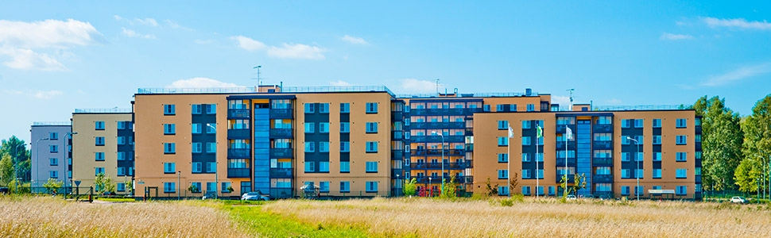

## ДЕТАЛИ

**Ген. подрядчик**: ЗАО «ЭнСиСи Строительство»  
**Партнер**: ЗАО «ЭнСиСи Строительство»  
**Местоположение**: г.Всеволожск, 11км Дороги Жизни  
**Начало работ**: Декабрь 2007  
**Окончание работ**: Июль 2013

## О ПРОЕКТЕ

Компания «Nokian Tyres» являлась заказчиком этого объекта.

Данный микрорайон построен для своих сотрудников компанией «Nokian Tyres» по программе нацеленной на долгосрочные трудовые отношения и решения жилищного вопроса сотрудников.

Наши сотрудники производили геодезическое сопровождение данного объекта первой очереди в период с декабря 2007г. по октябрь 2009г. и второй очереди с октября 2011г. по июль 2013г.

Геодезические работы производились с нулевого цикла и до окончания проекта.

Также на данном объекте производились топографические работы и контрольно-исполнительные съемки (КИС).
