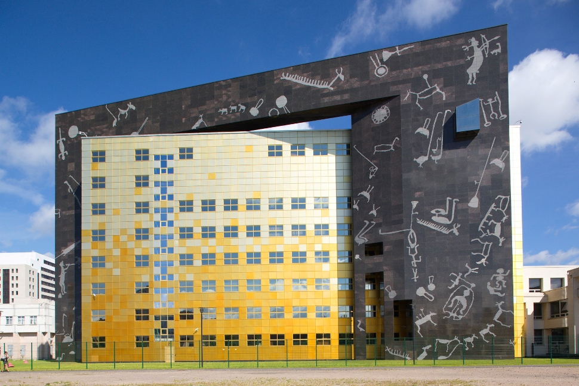

## ДЕТАЛИ

**Ген. подрядчик**: ООО «Лемминкяйнен Строй»  
**Партнер**: ООО «Лемминкяйнен Строй»  
**Местоположение**: г.Санкт-Петербург, Заусадебная ул. 37а  
**Начало работ**: 1990 год  
**Окончание работ**: 2006 год

## О ПРОЕКТЕ

Фондохранилище Государственного Эрмитажа строилось в две очереди.

Первая очередь строилась в период с 1990г. по 2003г., а вторая очередь с 2003г. по 2006г.

Наши специалисты производили геодезическое сопровождение двух очередей строительства. На данном объекте производились геодезические разбивочные работы и контрольные съемки. По завершении очередей были произведены топографические работы.
