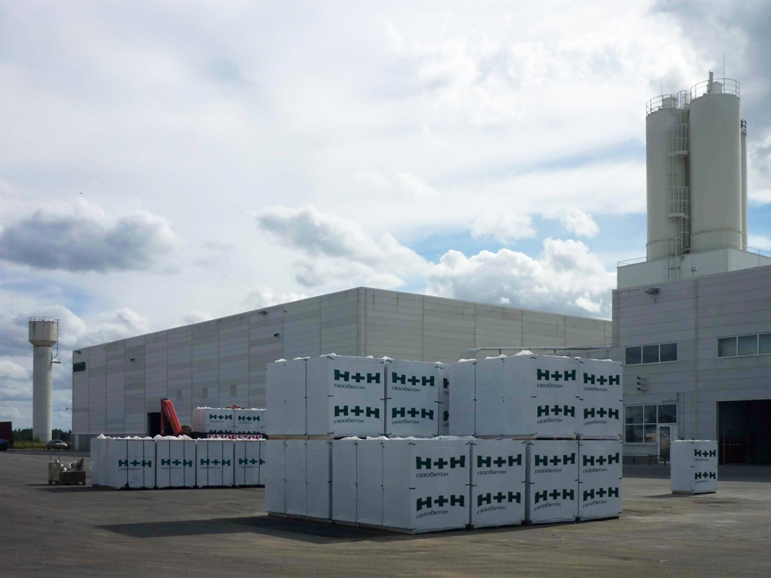

## ДЕТАЛИ

**Ген. подрядчик**: ООО «Х+Х Рус»  
**Партнер**: ООО «Х+Х Рус»  
**Местоположение**: Ленинградская обл., Волосовский р-н, пос. Кикерено, р-н 2-го квартала  
**Начало работ**: Октябрь 2008  
**Окончание работ**: Февраль 2009

## О ПРОЕКТЕ

Завод «H+H» - первый в России высокотехнологичный завод по производству автоклавного газобетона. Данное предприятие входит в международную группу «H+H International A/S».

Открытие завода состоялось в июне 2009 года. Производство оснащено оборудованием ведущих европейских компаний — Wehrhahn, Lachenmeier и Scholz.

На данном объекте производились не только работы по разбивке осей с созданием исполнительных схем по готовым конструкциям, но и работы по детальной разбивке элементов конструкций здания с созданием исп. схем. Также на данном объекте производились топографические работы.
