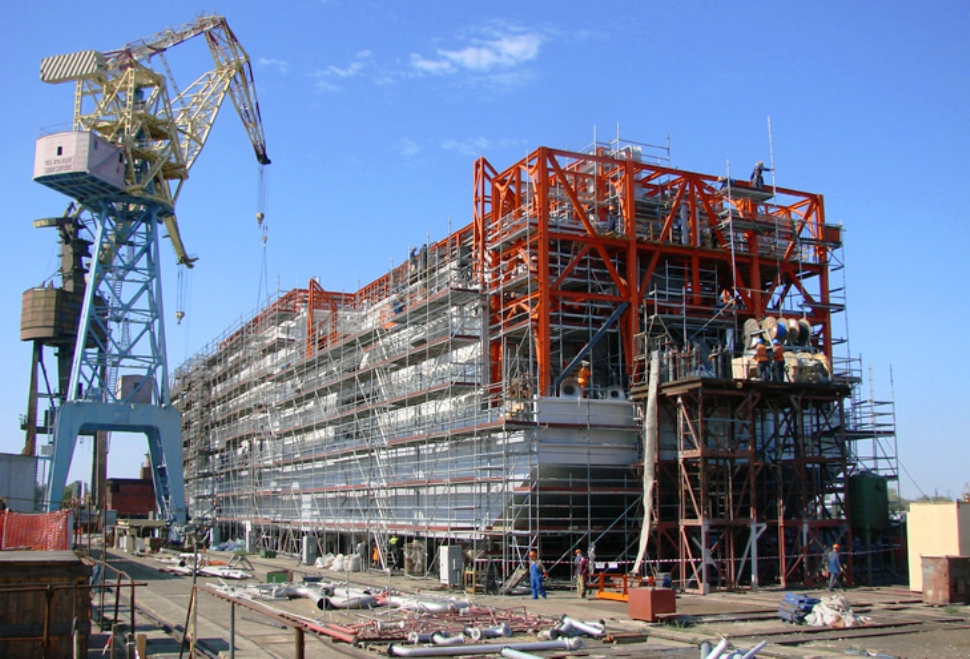

## ДЕТАЛИ

**Ген. подрядчик**: «Aker Kvaerner»  
**Партнер**: ООО «РР Оффшор»  
**Местоположение**: Астраханская обл., г. Астрахань  
**Начало работ**: Сентябрь 2006  
**Окончание работ**: Декабрь 2007

## О ПРОЕКТЕ

Заказчиком этого объекта являлась компания «Agip KCO».
«Модуль 10» – это эксплуатационная платформа, входящая в инфраструктуру Кашаганского месторождения и предназначенная для обслуживания нефтегазодобывающего комплекса. Назначение: пожаротушение, система пресной воды, производство азота.

«Кашаган»-гигантское шельфовое нефтегазовое месторождение Казахстана.

Разработкой месторождения занимается международное предприятие «North Caspian Operating Company» (NCOC).

Наши сотрудники производили геодезическое сопровождение данного объекта с сентября 2006г. по декабря 2007г. В частности, производились разбивочные работы элементов конструкций с контрольной съемкой после установки.
