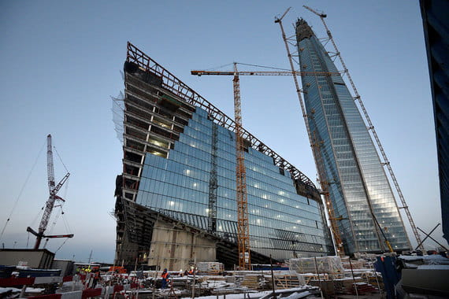

## ДЕТАЛИ

**Генеральный подрядчик**: Renaissance Construction  
**Партнер**: Lindner Group  
**Местоположение**: Санкт-Петербург, Лахтинский пр., д.2, корп. 3  
**Начало работ**: 2017 год  
**Окончание работ**: 2018 год

## О ПРОЕКТЕ

Сотрудники нашей компании производили геодезические работы при монтаже фасадов на здании МФЗ Лахта Центр. Все работы производились высокоточным оборудованием Leica с допуском до 3 мм при монтаже кронштейнов и панелей на внутреннем фасаде, и до 4 мм на холодном фасаде.

Лахта Центр строится в Санкт-Петербурге, на берегу Финского залива. Более трети площадей займут концептуальные общественные пространства. Строительство будет завершено в 2018 году. Доминанта комплекса – 462-метровый небоскреб – стала самым высоким зданием Европы.
