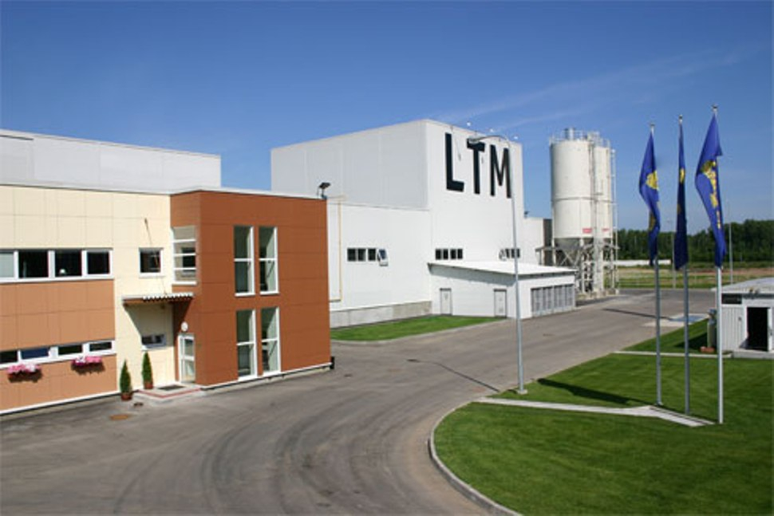

## ДЕТАЛИ

**Заказчик**: LTM Company LTD  
**Местоположение**: Калужская обл., г.Обнинск, Киевское ш., 70  
**Начало работ**: 2006 год  
**Окончание работ**: 2007 год

## О ПРОЕКТЕ

Финская компания LTM Company LTD производила строительство завода по изготовлению фасадных фиброцементных панелей.

Наши специалисты производили высокоточные геодезические работы по установке и выверке технологического оборудования в период с 2006г. по 2007г.
