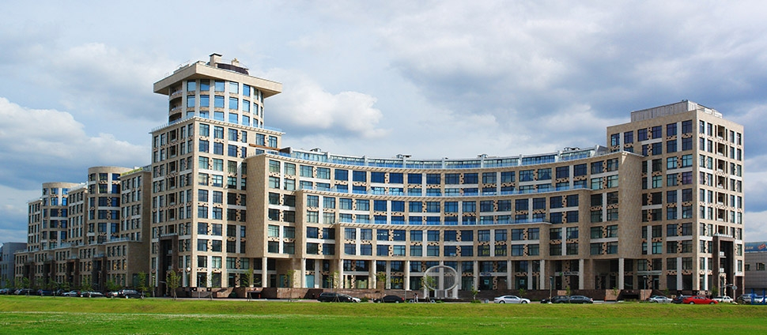

## ДЕТАЛИ

**Ген. подрядчик**: ООО «Ремстрой-7»  
**Партнер**: ЗАО «ОМЕГА»  
**Местоположение**: г.Санкт-Петербург, Левашовский пр. 13.  
**Начало работ**: Февраль 2004  
**Окончание работ**: Август 2006

## О ПРОЕКТЕ

Компания «ОМЕГА» являлась заказчиком этого объекта, а также нашим партнером.

Геодезические работы производились с нулевого цикла до окончания проекта, а также производили наблюдение за осадками здания, начиная с периода окончания монолитных работ до ввода в эксплуатацию здания. Также на данном объекте производились топографические работы и контрольно-исполнительные съемки (КИС).
