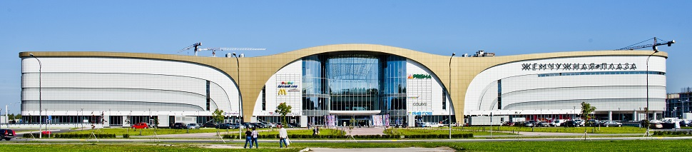

## ДЕТАЛИ

**Ген. подрядчик**: OOO «СРВ Девелопмент»  
**Партнер**: OOO «СРВ Девелопмент»  
**Местоположение**: г.Санкт-Петербург, Петергофское ш. 51.  
**Начало работ**: Март 2011  
**Окончание работ**: Август 2013

## О ПРОЕКТЕ

Наши специалисты производили геодезическое сопровождение данного объекта в период с марта 2011г. по август 2013г.

Геодезические работы производились с нулевого цикла до окончания проекта.

Сложность реализации данного объекта заключалась в его близком расположении у Матисова канала. Финское архитектурное бюро Larkas & Laine спроектировало этот торговый центр.

Также на данном объекте производились топографические работы и контрольно-исполнительные съемки (КИС).
