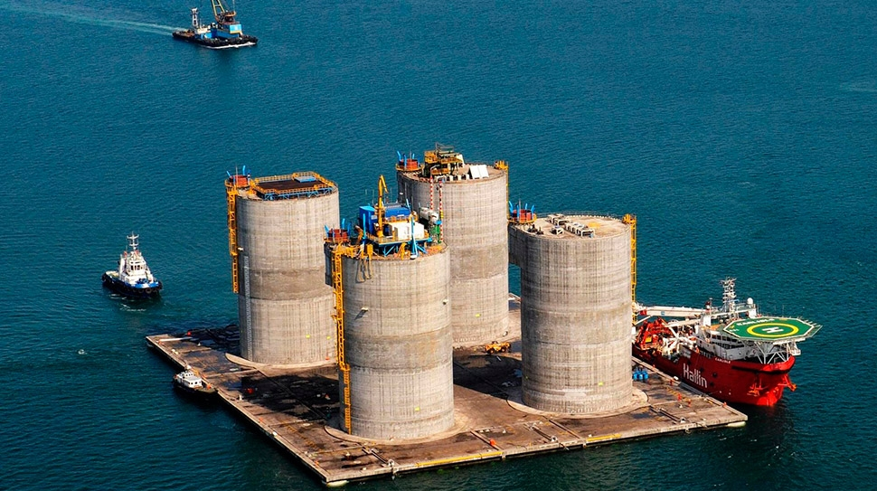

## ДЕТАЛИ

**Генеральный подрядчик**: «Акер Контрактинг Россия АС»  
**Партнер**: «Акер Контрактинг Россия АС»  
**Местоположение**: о. Сахалин.  
**Начало работ**: Январь 2010  
**Окончание работ**: Декабрь 2011

## О ПРОЕКТЕ

Специалисты нашей компании производили геодезические работы при постройке железобетонного основания гравитационного типа для платформы, предназначенной для добычи нефти с месторождения Аркутун-Даги о. Сахалин.

Это месторождение расположено на расстоянии около 25км от береговой линии на северо-востоке о. Сахалин. Сырая нефть, добываемая с месторождения Аркутун-Даги, будет направляться на береговой комплекс подготовки Чайво, а затем по магистральному нефтепроводу на экспортный терминал Де-Кастри для последующей отгрузки.
