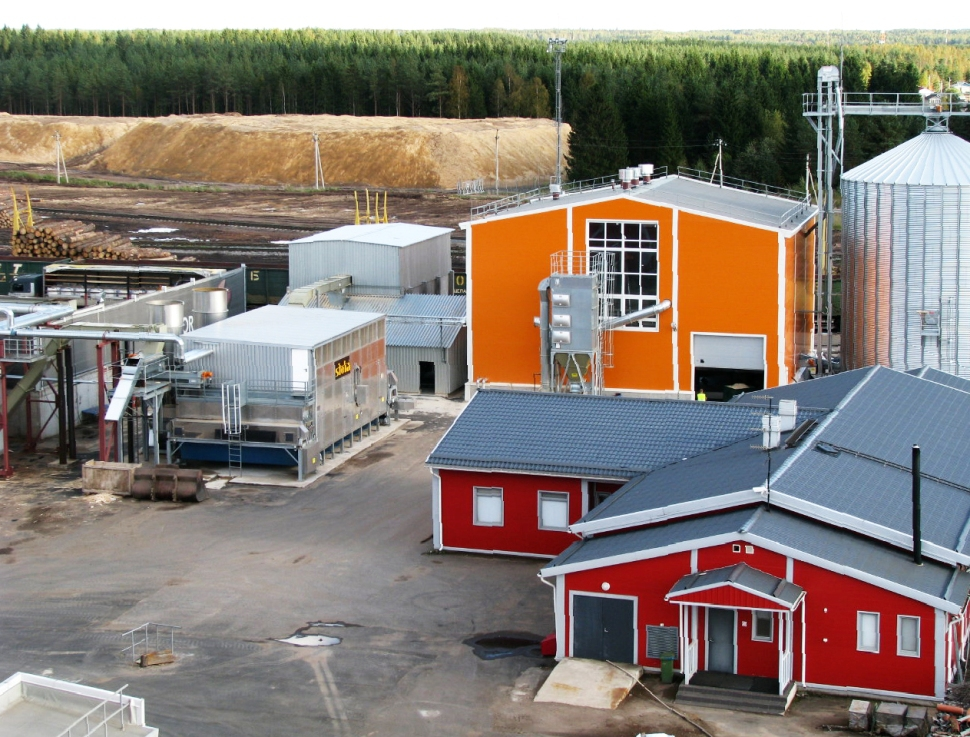

## ДЕТАЛИ

**Ген. подрядчик**: ООО «Сетново»  
**Партнер**: ООО «Сетново»  
**Местоположение**: Новгородская обл., пос. Неболчи, завод «Сетново»  
**Начало работ**: 2003 год  
**Окончание работ**: Март 2008

## О ПРОЕКТЕ

Завод «Сетново» — лесопильный завод в поселке Неболчи Новгородской обл. Строительство завода началось с 2003 года, а с 2006г. по март 2008 года происходило расширение производства 2-го пускового комплекса. Заказчиком этого объекта являлась финско-шведская компания «Stora Enso».

Наши специалисты производили геодезическое сопровождение данного объекта с 2003г. по март 2008 года. На данном объекте производились геодезические работы по разбивке осей с созданием исполнительных схем по готовым конструкциям, но и работы по детальной разбивке элементов конструкций с созданием исп. схем.
